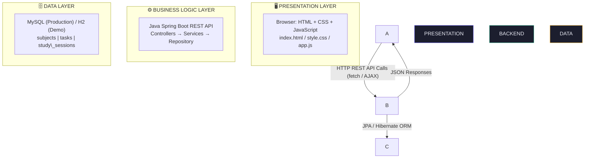
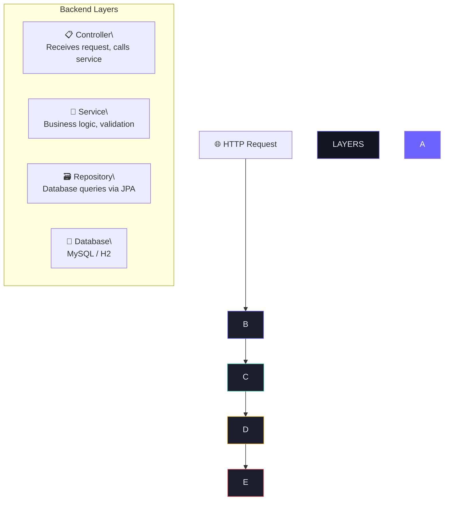
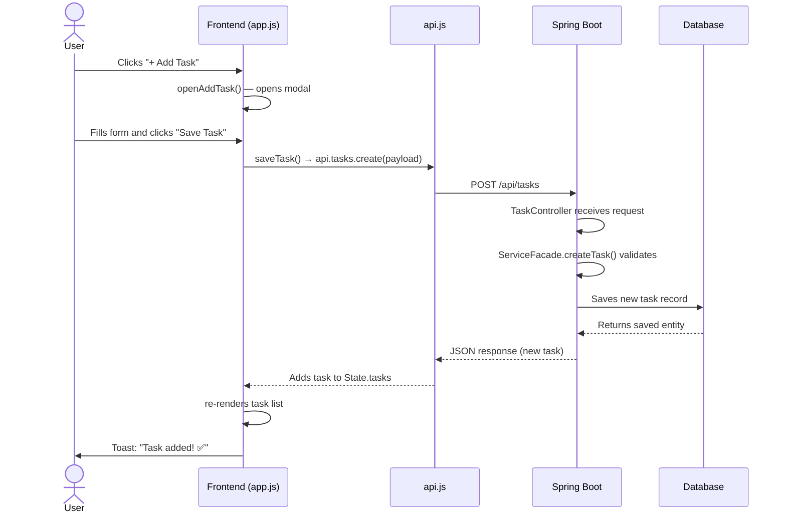
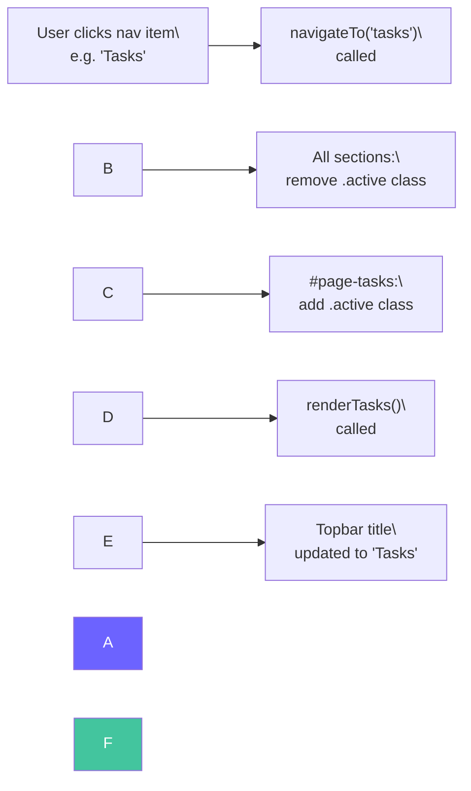

# ◈ StudyFlow — Smart Study Planner

### Official Project Documentation

> \*\*Version:\*\* 1.0.0 \&nbsp;|\&nbsp; \*\*Date:\*\* March 2026 \&nbsp;|\&nbsp; \*\*Author:\*\* Aditi Darekar, Arya Jadhav.

\---

## Project Metadata

|Field|Details|
|-|-|
|**Project Name**|StudyFlow — Smart Study Planner|
|**Version**|1.0.0|
|**Type**|Full-Stack Web Application|
|**Frontend**|HTML5, CSS3, Vanilla JavaScript|
|**Backend**|Java 17, Spring Boot 3.5|
|**Database**|MySQL 8 / H2 (Demo)|
|**Build Tool**|Maven 3.8|
|**Author**|Aditi|
|**Date**|March 2026|

\---

## Table of Contents

1. [Project Overview](#1-project-overview)
2. [System Architecture](#2-system-architecture)
3. [Features Explained](#3-features-explained)
4. [Project Folder Structure](#4-project-folder-structure)
5. [Frontend — HTML, CSS, JavaScript](#5-frontend--html-css-javascript)
6. [Backend — Java Spring Boot](#6-backend--java-spring-boot)
7. [Database Design](#7-database-design)
8. [API Reference](#8-api-reference)
9. [How the App Works (Flow)](#9-how-the-app-works-flow)
10. [Setup \& Installation Guide](#10-setup--installation-guide)
11. [Running the Project](#11-running-the-project)
12. [Technology Stack](#12-technology-stack)
13. [Glossary](#13-glossary)

\---

## 1\. Project Overview

**StudyFlow** is a full-stack web application designed to help students plan, organize, and track their academic studies. It provides a clean, modern interface where students can manage subjects, create tasks, schedule study sessions, use a Pomodoro focus timer, and track their progress — all in one place.

> 💡 \*\*Key Idea:\*\* StudyFlow works completely offline using the browser's `localStorage`, and connects to a Java Spring Boot backend when available for permanent data storage.

### 1.1 What Problem Does It Solve?

Students often struggle with:

* Keeping track of multiple subjects and assignments
* Remembering due dates and priorities
* Planning study time effectively across the week
* Staying focused during study sessions
* Measuring their own progress and consistency

StudyFlow solves all of these with one unified application.

### 1.2 Who Is This For?

|User Type|Use Case|
|-|-|
|**School Students**|Track homework, tests, and project deadlines|
|**College Students**|Manage multiple subjects and exam schedules|
|**Self-Learners**|Organize personal learning goals and milestones|
|**Competitive Exam Prep**|Schedule daily study blocks with Pomodoro timer|

\---

## 2\. System Architecture

StudyFlow follows a classic **3-Tier Architecture**: Presentation Layer (Frontend), Business Logic Layer (Backend), and Data Layer (Database).

### 2.1 Architecture Diagram



### 2.2 How Layers Communicate

|Communication|How It Works|
|-|-|
|**Frontend → Backend**|HTTP requests using the `fetch()` API in JavaScript (`api.js`)|
|**Backend → Database**|Spring Data JPA with Hibernate ORM automatically maps Java objects to database tables|
|**Backend → Frontend**|JSON responses — all data is sent as JSON format|
|**Offline Mode**|If backend is unavailable, `api.js` automatically falls back to browser `localStorage`|

\---

## 3\. Features Explained

StudyFlow has **6 main pages/features** accessible from the sidebar navigation.

### 3.1 Dashboard

The home screen that shows a summary of everything at a glance.

* Greeting message based on time of day (Good morning / afternoon / evening)
* 4 stat cards: Total Subjects, Tasks Done, Pending Tasks, and Day Streak
* **Today's Tasks** panel — shows pending tasks due today
* **Upcoming Schedule** panel — shows next 4 study sessions

### 3.2 Subjects

Create and manage your academic subjects or courses.

* Add a subject with a name, description, and color label
* Each subject card shows total tasks, completed tasks, and a progress bar
* Edit or delete subjects at any time
* 6 color options to visually distinguish subjects

### 3.3 Tasks

Create, manage, and track individual study tasks or assignments.

* Add tasks with title, subject, due date, priority, and notes
* 3 priority levels: `Low` (green), `Medium` (orange), `High` (red)
* One-click checkbox to mark tasks as complete
* Filter tasks by status (All / Pending / Completed) and by subject
* Completed tasks are shown with strikethrough styling

### 3.4 Study Schedule

A 7-day weekly calendar view for scheduling study sessions.

* Shows the current week from Monday to Sunday
* Today's column is highlighted in purple
* Add study sessions with subject, date, start time, end time, and notes
* Each session block is color-coded by subject
* Click any session block to edit it

### 3.5 Focus Timer (Pomodoro)

A built-in Pomodoro timer to help students stay focused.

* 3 modes: **Pomodoro** (25 min), **Short Break** (5 min), **Long Break** (15 min)
* Animated SVG ring that fills as time progresses
* Start, Pause, and Reset controls
* Link a task to the current timer session
* Counts total Pomodoros completed today
* Browser notification when timer ends

### 3.6 Progress

Visual progress tracking across all subjects and weekly activity.

* Per-subject progress bars showing completed vs total tasks
* Weekly activity bar chart showing study sessions for the past 7 days

\---

## 4\. Project Folder Structure

The project is divided into two main folders: `frontend` (user interface) and `backend` (server + database logic).

```text
study-planner/
├── frontend/
│   ├── index.html                          ← Main HTML file (single page)
│   ├── css/
│   │   └── style.css                       ← All styles and animations
│   └── js/
│       ├── api.js                          ← API calls + localStorage fallback
│       └── app.js                          ← All app logic and UI interactions
│
└── backend/
    ├── pom.xml                             ← Maven dependencies config
    └── src/main/
        ├── java/com/studyplanner/
        │   ├── StudyPlannerApplication.java ← App entry point
        │   ├── config/
        │   │   └── CorsConfig.java         ← CORS setup
        │   ├── model/
        │   │   ├── Subject.java            ← Subject data model
        │   │   ├── Task.java               ← Task data model
        │   │   └── StudySession.java       ← Session data model
        │   ├── dto/
        │   │   └── DTOs.java               ← Request/Response objects
        │   ├── repository/
        │   │   └── Repositories.java       ← Database query interfaces
        │   ├── service/
        │   │   └── StudyPlannerServiceFacade.java ← Business logic
        │   └── controller/
        │       └── Controllers.java        ← REST API endpoints
        └── resources/
            ├── application.properties      ← App configuration
            └── schema.sql                  ← MySQL database schema
```

\---

## 5\. Frontend — HTML, CSS, JavaScript

The frontend is a **Single Page Application (SPA)** — only one HTML file loads, and JavaScript dynamically switches between pages without reloading.

### 5.1 `index.html` — Structure

The HTML file defines the entire skeleton of the application.

|HTML Element|Purpose|
|-|-|
|`<aside class="sidebar">`|Left navigation panel with links to all 6 pages|
|`<main class="main-content">`|Right side where page content is displayed|
|`<section id="page-dashboard">`|Dashboard page (hidden/shown by JavaScript)|
|`<section id="page-subjects">`|Subjects management page|
|`<section id="page-tasks">`|Tasks management page|
|`<section id="page-schedule">`|Weekly schedule calendar page|
|`<section id="page-timer">`|Pomodoro focus timer page|
|`<section id="page-progress">`|Progress tracking page|
|**Modal Overlays (3)**|Popup dialogs for adding Subjects, Tasks, and Sessions|
|**Toast Container**|Area for showing notification messages|

### 5.2 `style.css` — Design System

The CSS uses **CSS Custom Properties (variables)** to maintain a consistent dark theme throughout the app.

```css
:root {
  --bg:      #0E0F14;  /\* Main background — very dark navy   \*/
  --bg2:     #141520;  /\* Card/sidebar background            \*/
  --bg3:     #1C1E2E;  /\* Input/hover background             \*/
  --accent:  #6C63FF;  /\* Purple — primary action color      \*/
  --accent2: #FF6584;  /\* Pink — secondary accent            \*/
  --green:   #43C59E;  /\* Success / Low priority             \*/
  --orange:  #F7B731;  /\* Warning / Medium priority          \*/
  --red:     #FC5C65;  /\* Error / High priority              \*/
  --text:    #E8E9F3;  /\* Main text color                    \*/
  --text2:   #9B9DBF;  /\* Secondary/muted text               \*/
}
```

**Fonts used:**

* **Syne (Bold)** — headings, numbers, and logo
* **DM Sans** — body text, labels, and buttons

### 5.3 `api.js` — API Service Layer

This file acts as the communication bridge between the UI and the backend. It contains two systems:

|Component|What It Does|
|-|-|
|`API` object|Makes real HTTP requests to the Spring Boot backend at `localhost:8080`|
|`LOCAL` object|Stores and retrieves data from browser `localStorage` when backend is offline|
|**Auto-fallback**|If the backend is unreachable, `api.js` automatically switches to `LOCAL` mode — the user sees no difference|
|`request()` function|Central function that handles `GET`, `POST`, `PUT`, `PATCH`, `DELETE` requests|

### 5.4 `app.js` — Application Logic

This is the largest file — it controls everything the user sees and interacts with.

|Function|What It Does|
|-|-|
|`State` object|Holds all data in memory: `subjects\[]`, `tasks\[]`, `sessions\[]`, timer settings|
|`navigateTo(page)`|Switches between pages by showing/hiding `<section>` elements|
|`loadAll()`|Loads all data from API on startup and stores in `State`|
|`renderSubjects()`|Generates subject cards HTML dynamically from `State.subjects`|
|`renderTasks()`|Generates task items HTML with filtering applied|
|`renderSchedule()`|Builds the 7-day week calendar from `State.sessions`|
|`startTimer()`|Starts the Pomodoro countdown with `setInterval()`|
|`renderProgress()`|Calculates completion % per subject and draws weekly chart|
|`toast(msg, type)`|Shows temporary notification messages (success/error/info)|
|`openModal/closeModal`|Shows and hides popup dialog boxes|

\---

## 6\. Backend — Java Spring Boot

The backend is a **RESTful API** built with Spring Boot. It receives HTTP requests from the frontend, processes them, and returns JSON responses. Data is stored in a database using JPA (Java Persistence API).

### 6.1 Spring Boot Architecture Pattern

The backend follows a layered architecture:



### 6.2 Java Files Explained

|File|Purpose|
|-|-|
|`StudyPlannerApplication.java`|The entry point — contains the `main()` method that starts the entire Spring Boot server|
|`CorsConfig.java`|Configures CORS (Cross-Origin Resource Sharing) — allows the browser frontend at port `5500` to call the API at port `8080` without being blocked|
|`Subject.java`|Entity class — maps to the `subjects` table. Fields: `id`, `name`, `description`, `color`, `createdAt`|
|`Task.java`|Entity class — maps to the `tasks` table. Fields: `id`, `title`, `notes`, `dueDate`, `priority`, `completed`, `completedAt`, `subject`|
|`StudySession.java`|Entity class — maps to the `study\_sessions` table. Fields: `id`, `date`, `startTime`, `endTime`, `notes`, `subject`|
|`DTOs.java`|Data Transfer Objects — defines request objects (`SubjectRequest`, `TaskRequest`, `SessionRequest`) and response objects (`TaskResponse`, `SessionResponse`)|
|`Repositories.java`|Interfaces extending `JpaRepository` — Spring auto-provides methods like `findAll()`, `findById()`, `save()`, `deleteById()`|
|`StudyPlannerServiceFacade.java`|All business logic — converting between entities and DTOs, validation, calling repositories. All CRUD operations for subjects, tasks, and sessions|
|`Controllers.java`|Defines all REST API endpoints using `@GetMapping`, `@PostMapping`, `@PutMapping`, `@PatchMapping`, `@DeleteMapping`. Also contains `GlobalExceptionHandler`|

### 6.3 Key Java Annotations Used

|Annotation|What It Does|
|-|-|
|`@SpringBootApplication`|Marks the main class — enables component scanning, auto-configuration|
|`@RestController`|Marks a class as a REST API controller — returns JSON automatically|
|`@RequestMapping`|Sets the base URL path for a controller (e.g. `/api/subjects`)|
|`@GetMapping`|Handles HTTP `GET` requests — for fetching data|
|`@PostMapping`|Handles HTTP `POST` requests — for creating data|
|`@PutMapping`|Handles HTTP `PUT` requests — for updating data|
|`@PatchMapping`|Handles HTTP `PATCH` requests — for partial updates (toggle complete)|
|`@DeleteMapping`|Handles HTTP `DELETE` requests — for deleting data|
|`@Entity`|Marks a Java class as a database table|
|`@Table`|Specifies the database table name|
|`@Id`|Marks the primary key field|
|`@GeneratedValue`|Auto-generates the ID value (auto-increment)|
|`@Column`|Maps a field to a database column with optional constraints|
|`@ManyToOne`|Defines a many-to-one relationship (many tasks belong to one subject)|
|`@OneToMany`|Defines a one-to-many relationship (one subject has many tasks)|
|`@Transactional`|Wraps a method in a database transaction — changes are rolled back if an error occurs|
|`@RequiredArgsConstructor`|Lombok — auto-generates constructor for `final` fields (dependency injection)|
|`@Data`|Lombok — auto-generates getters, setters, `equals`, `hashCode`, `toString`|
|`@Builder`|Lombok — enables the builder pattern for creating objects|
|`@RestControllerAdvice`|Global exception handler — catches errors from all controllers|

\---

## 7\. Database Design

The application uses **3 database tables**. Tasks and sessions both belong to a subject via foreign keys.

### 7.1 Entity Relationship Diagram

```mermaid
erDiagram
    SUBJECTS {
        BIGINT id PK "Auto-increment"
        VARCHAR\_100 name "NOT NULL"
        VARCHAR\_500 description "Optional"
        VARCHAR\_7 color "Hex code e.g. #6C63FF"
        DATETIME created\_at
    }

    TASKS {
        BIGINT id PK "Auto-increment"
        VARCHAR\_200 title "NOT NULL"
        VARCHAR\_1000 notes "Optional"
        DATE due\_date "Optional"
        ENUM priority "LOW | MEDIUM | HIGH"
        BOOLEAN completed "Default: false"
        DATETIME completed\_at
        DATETIME created\_at
        BIGINT subject\_id FK
    }

    STUDY\_SESSIONS {
        BIGINT id PK "Auto-increment"
        DATE date "NOT NULL"
        TIME start\_time "NOT NULL"
        TIME end\_time "NOT NULL"
        VARCHAR\_500 notes "Optional"
        DATETIME created\_at
        BIGINT subject\_id FK "NOT NULL"
    }

    SUBJECTS ||--o{ TASKS : "has many (SET NULL on delete)"
    SUBJECTS ||--o{ STUDY\_SESSIONS : "has many (CASCADE on delete)"
```

### 7.2 Table: `subjects`

|Column|Type|Description|
|-|-|-|
|`id`|`BIGINT`|Primary key, auto-increment|
|`name`|`VARCHAR(100)`|Subject name — required, not null|
|`description`|`VARCHAR(500)`|Optional description|
|`color`|`VARCHAR(7)`|Hex color code like `#6C63FF`|
|`created\_at`|`DATETIME`|Timestamp when record was created|

### 7.3 Table: `tasks`

|Column|Type|Description|
|-|-|-|
|`id`|`BIGINT`|Primary key, auto-increment|
|`title`|`VARCHAR(200)`|Task title — required|
|`notes`|`VARCHAR(1000)`|Optional notes|
|`due\_date`|`DATE`|Optional due date|
|`priority`|`ENUM`|`LOW`, `MEDIUM`, or `HIGH`|
|`completed`|`BOOLEAN`|`true` = done, `false` = pending|
|`completed\_at`|`DATETIME`|When task was completed|
|`created\_at`|`DATETIME`|When task was created|
|`subject\_id`|`BIGINT (FK)`|Foreign key → `subjects.id`|

### 7.4 Table: `study\_sessions`

|Column|Type|Description|
|-|-|-|
|`id`|`BIGINT`|Primary key, auto-increment|
|`date`|`DATE`|Date of the session — required|
|`start\_time`|`TIME`|Start time — required|
|`end\_time`|`TIME`|End time — required|
|`notes`|`VARCHAR(500)`|Optional notes for the session|
|`created\_at`|`DATETIME`|When session was created|
|`subject\_id`|`BIGINT (FK)`|Foreign key → `subjects.id` (NOT NULL)|

### 7.5 Relationship Rules

* One subject can have **MANY** tasks
* One subject can have **MANY** study sessions
* If a subject is **deleted**, its sessions are also deleted (**CASCADE**)
* If a subject is **deleted**, its tasks remain but `subject\_id` becomes `NULL`

\---

## 8\. API Reference

All API endpoints are prefixed with `http://localhost:8080/api`. All requests and responses use **JSON** format.

### 8.1 Subjects API

|Method|Endpoint|Description|
|-|-|-|
|`GET`|`/api/subjects`|Get all subjects|
|`GET`|`/api/subjects/{id}`|Get one subject by ID|
|`POST`|`/api/subjects`|Create a new subject|
|`PUT`|`/api/subjects/{id}`|Update an existing subject|
|`DELETE`|`/api/subjects/{id}`|Delete a subject|

**`POST /api/subjects` — Request body:**

```json
{
  "name": "Mathematics",
  "description": "Calculus, Algebra, Statistics",
  "color": "#6C63FF"
}
```

### 8.2 Tasks API

|Method|Endpoint|Description|
|-|-|-|
|`GET`|`/api/tasks`|Get all tasks|
|`GET`|`/api/tasks/{id}`|Get one task by ID|
|`POST`|`/api/tasks`|Create a new task|
|`PUT`|`/api/tasks/{id}`|Update an existing task|
|`PATCH`|`/api/tasks/{id}/toggle`|Toggle task completed/pending|
|`DELETE`|`/api/tasks/{id}`|Delete a task|

**`POST /api/tasks` — Request body:**

```json
{
  "title": "Solve Integration Problems",
  "subjectId": 1,
  "dueDate": "2026-03-20",
  "priority": "HIGH",
  "notes": "Chapter 7 exercises"
}
```

### 8.3 Study Sessions API

|Method|Endpoint|Description|
|-|-|-|
|`GET`|`/api/sessions`|Get all study sessions|
|`POST`|`/api/sessions`|Create a new session|
|`PUT`|`/api/sessions/{id}`|Update an existing session|
|`DELETE`|`/api/sessions/{id}`|Delete a session|

**`POST /api/sessions` — Request body:**

```json
{
  "subjectId": 1,
  "date": "2026-03-18",
  "startTime": "09:00",
  "endTime": "11:00",
  "notes": "Integration techniques"
}
```

### 8.4 Stats API

|Method|Endpoint|Description|
|-|-|-|
|`GET`|`/api/stats/summary`|Dashboard summary: subject count, tasks done/pending, streak|
|`GET`|`/api/stats/weekly`|Count of study sessions for the last 7 days|

\---

## 9\. How the App Works (Flow)

### 9.1 App Startup Flow

```mermaid
flowchart TD
    A\["🌐 Browser opens index.html"] --> B\["app.js DOMContentLoaded fires"]
    B --> C\["loadAll() is called"]

    C --> D1\["api.subjects.getAll()\\nGET /api/subjects"]
    C --> D2\["api.tasks.getAll()\\nGET /api/tasks"]
    C --> D3\["api.sessions.getAll()\\nGET /api/sessions"]
    C --> D4\["api.stats.getSummary()\\nGET /api/stats/summary"]

    D1 \& D2 \& D3 \& D4 --> E{Backend reachable?}

    E -->|"✅ Online"| F\["Data stored in State object"]
    E -->|"❌ Offline"| G\["localStorage fallback"]
    G --> F

    F --> H\["🎨 refreshDashboard() renders UI"]

    style A fill:#6C63FF,color:#fff
    style H fill:#43C59E,color:#fff
    style E fill:#F7B731,color:#0E0F14
```

### 9.2 Adding a Task Flow



### 9.3 Navigation Flow

Page navigation works without any page reload:



\---

## 10\. Setup \& Installation Guide

### 10.1 Prerequisites

Install these tools before starting:

|Tool|Where to Get It|
|-|-|
|**VS Code**|Code editor — [code.visualstudio.com](https://code.visualstudio.com)|
|**Java JDK 17**|[adoptium.net](https://adoptium.net) (choose Temurin 17)|
|**Maven 3.8+**|[maven.apache.org](https://maven.apache.org)|
|**Live Server Extension**|VS Code extension by Ritwick Dey|
|**Spring Boot Extension Pack**|VS Code extension by VMware|
|**Extension Pack for Java**|VS Code extension by Microsoft|
|**MySQL 8** *(Optional)*|Only for production — [mysql.com](https://mysql.com)|

### 10.2 Verify Installation

Open VS Code Terminal (`Ctrl + `` ` ``) and run:

```bash
java -version
# Should show: openjdk 17.x.x

mvn -version
# Should show: Apache Maven 3.x.x
```

### 10.3 Project Setup Steps

**Step 1 — Create the project folder:**

```bash
mkdir C:\\Users\\Aditi\\study-planner
```

**Step 2 — Open in VS Code:** `File → Open Folder`

**Step 3 — Generate backend via Spring Initializr:**

`Ctrl+Shift+P` → `Spring Initializr: Create a Maven Project`

Select these options:

|Option|Value|
|-|-|
|Build Tool|Maven|
|Language|Java|
|Spring Boot|3.5.x|
|Group|`com.studyplanner`|
|Artifact|`study-planner-backend`|
|Java Version|17|
|Dependencies|Spring Web, Spring Data JPA, DevTools, Validation, MySQL Driver, H2 Database, Lombok|

Generate into the `study-planner` folder and rename the generated folder to `backend`.

**Step 4 — Create frontend files:**

```powershell
cd C:\\Users\\Aditi\\study-planner
mkdir frontend\\css, frontend\\js | Out-Null
New-Item frontend\\index.html, frontend\\css\\style.css, frontend\\js\\api.js, frontend\\js\\app.js -Force
```

**Step 5 — Create Java subfolders:**

```powershell
cd backend/src/main/java/com/studyplanner
mkdir config, model, dto, repository, service, controller | Out-Null
New-Item config/CorsConfig.java, model/Subject.java, model/Task.java, `
  model/StudySession.java, dto/DTOs.java, repository/Repositories.java, `
  service/StudyPlannerServiceFacade.java, controller/Controllers.java -Force
```

**Step 6 — Paste all code** into the corresponding files and save with `Ctrl+S`.

\---

## 11\. Running the Project

### 11.1 Run the Frontend

1. Open VS Code
2. In Explorer, find `frontend/index.html`
3. Right-click → **"Open with Live Server"**
4. Browser opens automatically at:

```
http://127.0.0.1:5500/frontend/index.html
```

> ✅ \*\*Demo Mode:\*\* The frontend works immediately without the backend! All data is saved in your browser `localStorage` automatically.

### 11.2 Run the Backend

```bash
cd backend
mvn spring-boot:run
```

Wait for this confirmation message:

```
✅ StudyFlow API started at http://localhost:8080/api
```

The frontend will now use the real backend instead of `localStorage`.

### 11.3 Verify Everything Works

|What|URL|
|-|-|
|**Frontend App**|`http://127.0.0.1:5500/frontend/index.html`|
|**Backend API**|`http://localhost:8080/api/subjects` (should return `\[]`)|
|**H2 Database Console**|`http://localhost:8080/h2-console`|

### 11.4 H2 Console Login

|Field|Value|
|-|-|
|**JDBC URL**|`jdbc:h2:mem:studyflow`|
|**Username**|`sa`|
|**Password**|*(leave blank)*|

\---

## 12\. Technology Stack

|Technology|Layer|Purpose|
|-|-|-|
|**HTML5**|Frontend|Structure and content of the web page|
|**CSS3**|Frontend|Styling, animations, responsive layout, CSS variables|
|**Vanilla JavaScript**|Frontend|App logic, API calls, DOM manipulation — no framework|
|**Google Fonts** (Syne + DM Sans)|Frontend|Typography — loaded from Google CDN|
|**Java 17**|Backend|Programming language for server-side logic|
|**Spring Boot 3.5**|Backend|Framework that simplifies Java web application development|
|**Spring Web**|Backend|Provides REST API capabilities with `@RestController`|
|**Spring Data JPA**|Backend|Simplifies database operations using Java interfaces|
|**Hibernate ORM**|Backend|Auto-maps Java classes to database tables|
|**Lombok**|Backend|Reduces boilerplate code (`@Getter`, `@Setter`, `@Builder`)|
|**Maven**|Build Tool|Manages Java dependencies and builds the project|
|**H2 Database**|Database|In-memory database for demo/testing — no setup needed|
|**MySQL 8**|Database|Production relational database for permanent data storage|
|**CORS Filter**|Backend|Allows frontend (port `5500`) to call backend (port `8080`)|
|**Browser localStorage**|Frontend|Offline fallback storage — no backend required|

\---

## 13\. Glossary

|Term|Definition|
|-|-|
|**API**|Application Programming Interface — a set of rules for how software components communicate|
|**REST API**|Representational State Transfer — an API design style using HTTP methods (GET, POST, PUT, DELETE)|
|**JSON**|JavaScript Object Notation — a lightweight text format for exchanging data between systems|
|**HTTP**|HyperText Transfer Protocol — the foundation of data communication on the web|
|**CORS**|Cross-Origin Resource Sharing — browser security feature that controls which domains can call your API|
|**JPA**|Java Persistence API — a Java specification for accessing, managing, and persisting data between Java objects and relational databases|
|**ORM**|Object-Relational Mapping — technique that converts data between Java objects and database tables automatically|
|**Entity**|A Java class that represents a database table (annotated with `@Entity`)|
|**DTO**|Data Transfer Object — a simple object used to carry data between layers of an application|
|**Repository**|An interface that provides database CRUD methods without writing SQL manually|
|**Service**|A class containing business logic — sits between Controller and Repository|
|**Controller**|A class that handles incoming HTTP requests and returns responses|
|**Maven**|A build and dependency management tool for Java projects|
|**pom.xml**|Project Object Model — Maven's configuration file listing all project dependencies|
|**Spring Boot**|A framework that makes it easy to create production-ready Java applications|
|**Lombok**|A Java library that automatically generates common code (getters, setters, constructors)|
|**H2**|A lightweight in-memory relational database written in Java — great for development|
|**Hibernate**|The ORM framework used by Spring Data JPA to communicate with the database|
|**localStorage**|Browser API that stores data as key-value pairs locally in the user's browser|
|**SPA**|Single Page Application — a web app that loads one HTML page and dynamically updates content|
|**Pomodoro**|A time management technique: 25 minutes of focused work followed by a 5-minute break|
|**CRUD**|Create, Read, Update, Delete — the four basic operations for managing data|
|**Foreign Key**|A database column that references the primary key of another table to link records|
|**Transactional**|A database operation treated as a single unit — either all succeeds or all fails|

\---

*StudyFlow Documentation v1.0.0 | Created March 2026 |* Aditi Darekar, Arya Jadhav.

